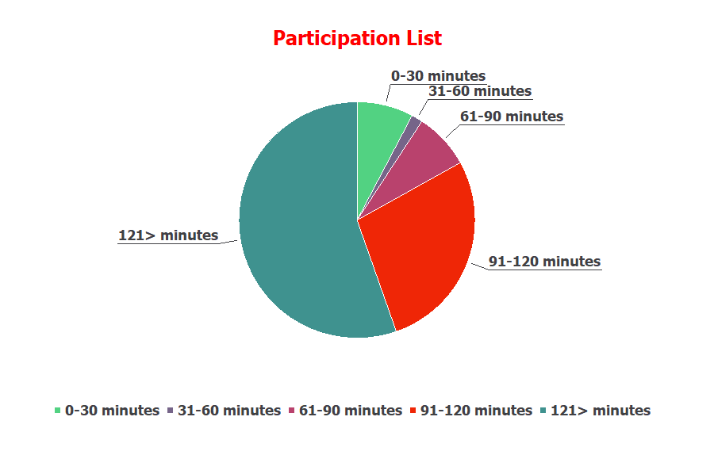
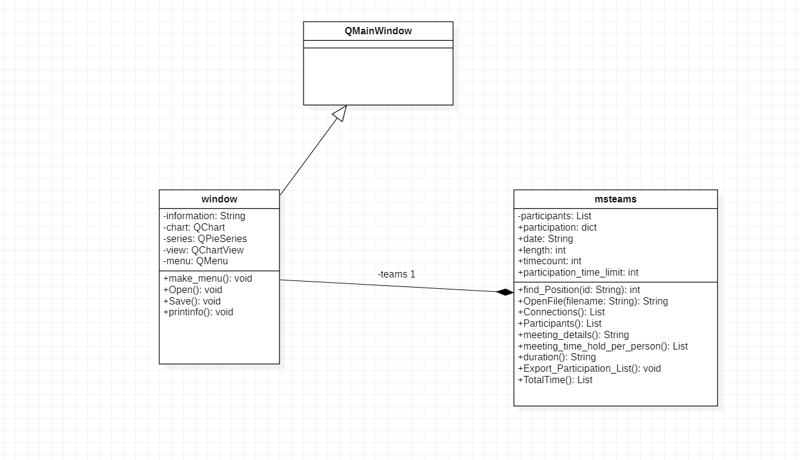

<html>
<body>
<h1>PieChart Example</h1>

<b style="font-size:24px;">Uml Diagram</b> 

<h3><u>Source Codes</u></h3>
<ul>
<li>Chart Gui:</li>
<li>Teams class:</li>
<li>Participant Class:</li>
<li>Full Package Zip:</li>
</ul>
</body>
</html>