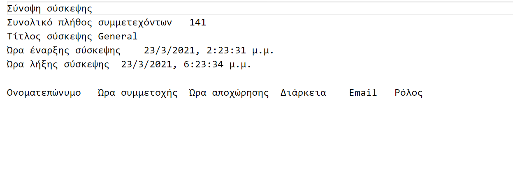

<html>
<body>
<h1>New update of Teams Participation List</h1>

 
-<b>Data Opener:</b><a href="ReadData.py">Code</a> 
-<b>New Participant:</b><a href="participant.py">Code</a> 
-<b>Time Converter Module:<b><a href="Time.py">Code</a> 
-<b>Sample Gui:</b><a href="gui.py">Gui</a> 
-<b>Driver Program:</b><a href="main.py">Main</a> 
-<b>Sample Source File:</b><a href="source.csv">Source</a> 
</body>
</html>
