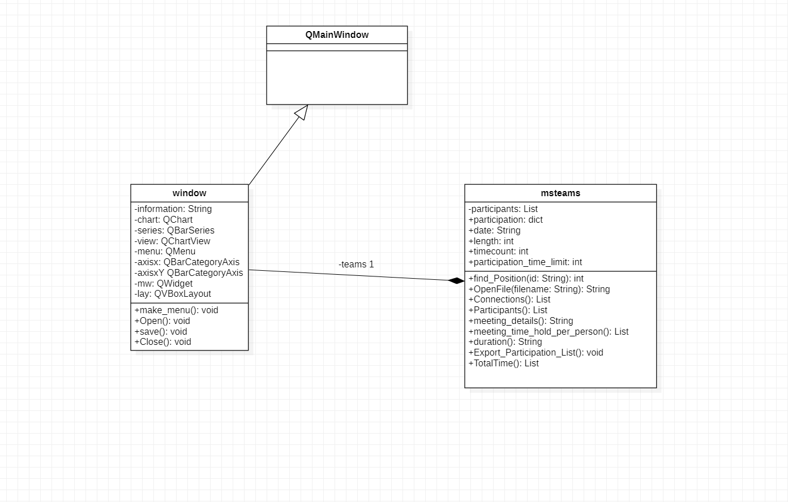

<h1>BarChart Example</h1>

<h2>Uml Diagram</h2>

<h3>Source Codes</h3>
<ul>
<li>Barchart Gui:</li>
<li>Participant Class:</li>
<li>teams Class:</li>
<li>Main:</li>
<li>Full Package Zip:</li>
</ul>
</body>
</html>